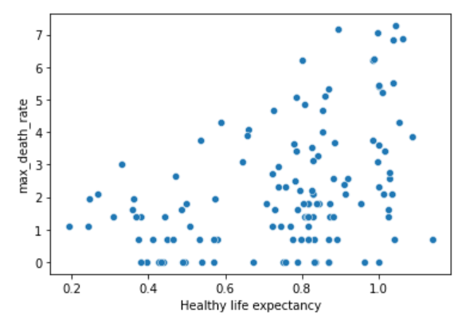

# COVID19-data-analysis

I used COVID19 dataset, published by John Hopkins University, which consist of the data related to cumulative number of confirmed cases, per day, in each Country. as well as another dataset consisting of various life factors, scored by the people living in each country around the globe.  The purpose of this project is to merge these two datasets to see if there is any relationship between the spread of the virus in a country and how happy people are, living in that country. I followed [Coursera's guided project](https://www.coursera.org/projects/covid19-data-analysis-using-python) , then continued analysing more deeply with practice dataset.

# Steps    
- Importing Covid19 dataset    
- Finding a good Measure    
- Importing and preparing World happiness report dataset    
- Merging two datasets and finding correlations among data
- Visualizing the results using Seaborn

# Results
### GDP per Capita and Maximum Infection Rate

### Social Support and Maximum Infection Rate

### Healthy Life Expectancy and Maximum Infection Rate

### Freedom to make Life Choices and Maximum Infection Rate

These plots show that people living in developed countries are more prone to get infected by Coronavirus compared to less developed countries. The reason behind this may be the lack of covid tests in those countries, so I decided to continue the project and use the dataset containing information about death rates.

# Results
### GDP per Capita and Maximum Death Rate

### Social Support and Maximum Death Rate

### Healthy Life Expectancy and Maximum Death Rate

### Freedom to make Life Choices and Maximum Death Rate

**The results showed that the mortality rate is also high in developed countries. One of the explanations can be the age, since in those countries usually have older population and age is a key risk factor for spreading and dying from Coronavirus.**
